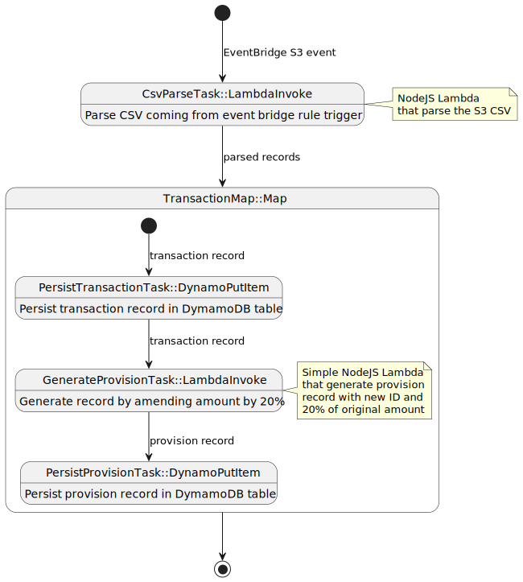

# Transaction Processor

An AWS CDK exercise. 

1. watch for CSVs with landing on S3 bucket
2. parse the CSV using Lambda function
3. persist each transaction into DynamoDB
4. generate new transaction record by amending amount of every transaction by 20%
5. persist provision transaction into DynamoDB as well

## AWS infrastructure deployed

- CloudFormation stack
- S3 bucket
- EventBridge rule
- DynamoDB table
- Step Functions state machine
- 2 Lambda functions
- relevant IAM roles & policies

## Expected CSV structure

| Column      | Type                  | Example                                |
|-------------|-----------------------|----------------------------------------|
| `ID`        | UUID                  | `1e003f65-a976-45ca-a74e-638f2808ab07` |
| `Date`      | ISO date              | `2023-04-06`                           |
| `AccountID` | arbitrary string      | `account_1a2c3b`                       |
| `Amount`    | floating point number | `103.4`                                |

## Step Functions schema

# How to deploy

`cdk deploy`

This will build CDK stack, including the Lambda functions and deploy to AWS.

> Make sure you have AWS CDK installed locally and confirm AWS profile to be used for deployment.

Optional deploy-time ENV vars:
- `AWS_ACCOUNT` AccountID to use for deployment (default is `CDK_DEFAULT_ACCOUNT`)
- `AWS_REGION` AWS region to use for deployment (default is `CDK_DEFAULT_REGION`)
- `TRANSACTIONS_PROVISION_RATIO` Amount amendment ratio for provision transaction record (default is `0.2`)

# Try it out

Find & store S3 bucket deployed by stack:
`export BUCKET_NAME=$(aws cloudformation describe-stack-resources --stack-name TransactionProcessorStack --output json | jq -r '.StackResources[] | select(.ResourceType=="AWS::S3::Bucket") | .PhysicalResourceId')`

Find & store DynamoDB table deployed by stack:
`export DYNAMO_TABLE_NAME=$(aws cloudformation describe-stack-resources --stack-name TransactionProcessorStack --output json | jq -r '.StackResources[] | select(.ResourceType=="AWS::DynamoDB::Table") | .PhysicalResourceId')`

Upload sample transaction file:
`aws s3 cp ./transactions_sample.csv "s3://$BUCKET_NAME/transactions/"`

List DynamoDB table:
`aws dynamodb scan --table-name "$DYNAMO_TABLE_NAME"`

# Amendments / limitations

- Lambda for CSV parsing might be insufficient due to limited memory and runtime. Bigger files would work better with Distributed Map stage. 
- Same goes for Step Functions state size. Currently transactions are passed to Map as part of the state. With larger files this can hit the State Functions state size limit. Could be solved by distributed Map as well.
- Stack implementation does not allow for use of existing S3 bucket. 